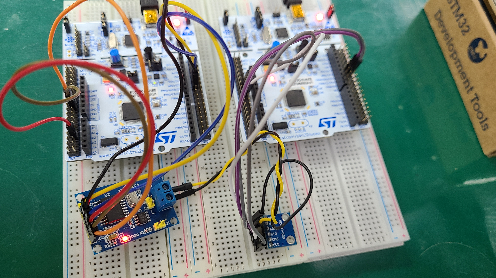
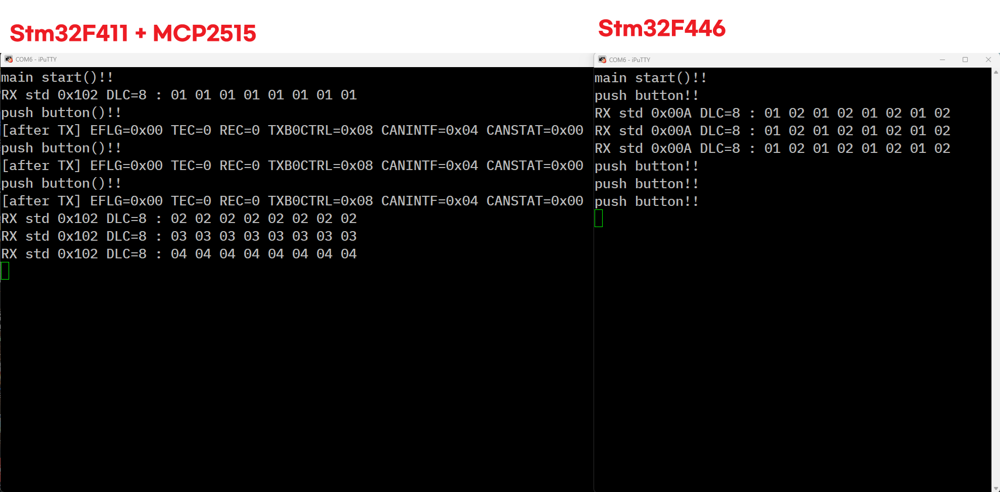

# autonomous-driving-project

### **특정 브랜치 Clone 하기**
```
git clone -b <branch-name> --single-branch <repo-url>

git clone -b Woojin5020 --single-branch https://github.com/whdtjr/autonomous-driving-project.git
```

---

# STM32 개발보드로 CAN 통신 실습

### **실습환경**
- 개발보드1 : Stm32F446RE (Can 컨트롤러 포함 보드)
- 개발보드2 : Stm32F411RE (Can 컨트롤러 미포함 보드)
- 모듈(**Can 컨트롤러 미포함 보드 사용시**) : [캔 트랜시버](https://m.vctec.co.kr/product/can-bus-%ED%8A%B8%EB%9E%9C%EC%8B%9C%EB%B2%84-%EB%AA%A8%EB%93%88-sn65hvd230-can-bus-transceiver-breakout-sn65hvd230/10725/), [캔 버스 모듈(SPI)](https://mechasolution.com/shop/goods/goods_view.php?goodsno=584623&category=132)


# STM32 CAN2.0B 하드웨어 구성



---

# STM32 CAN2.0B Test Pin_Map

## 1. STM32F411(SPI) <-> MCP2515 CAN 버스 모듈

| STM32F411 | MCP2515 |
|-----------|---------|
| PA4       | CS      |
| PA5       | SCK     |
| PA6       | SO      |
| PA7       | SI      |
| 5V        | VCC     |
| GND       | GND     |

## 2. MCP2515 CAN 버스 모듈 <-> CAN 트랜시버 <-> STM32F446(CAN)

| MCP2515 | CAN 트랜시버 | STM32F446 |
|--------|-------|--------------|
|        | CTX   | PA12(CAN_TX) |
|        | CRX   | PA11(CAN_RX) |
|        | 3V3   | 3.3V        |
|        | GND   | GND         |
| CANH   | CANH  |             |
| CANL   | CANL  |             |

## 3. 기타 제어 및 로깅

| 목적           | MCU        | 핀         | 용도                |
|----------------|------------|------------|---------------------|
| 송신 트리거     | STM32F411  | PC13       | GPIO 버튼           |
| UART 로그      | STM32F411  | USART2/PA2/PA3 | 115200bps (printf) |

- Uart 디버깅 사진


---