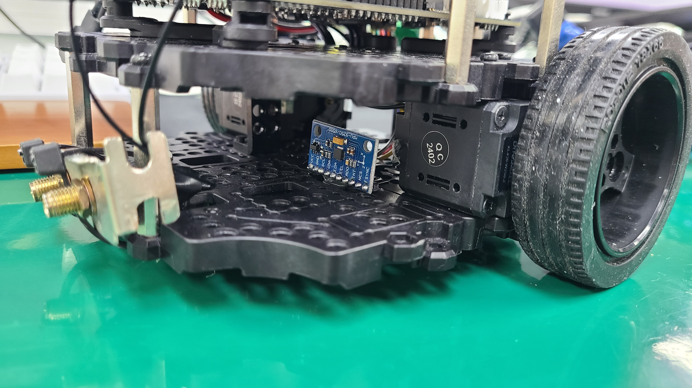
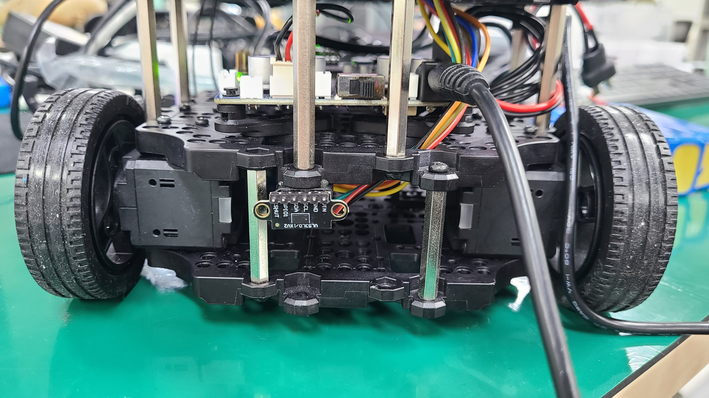
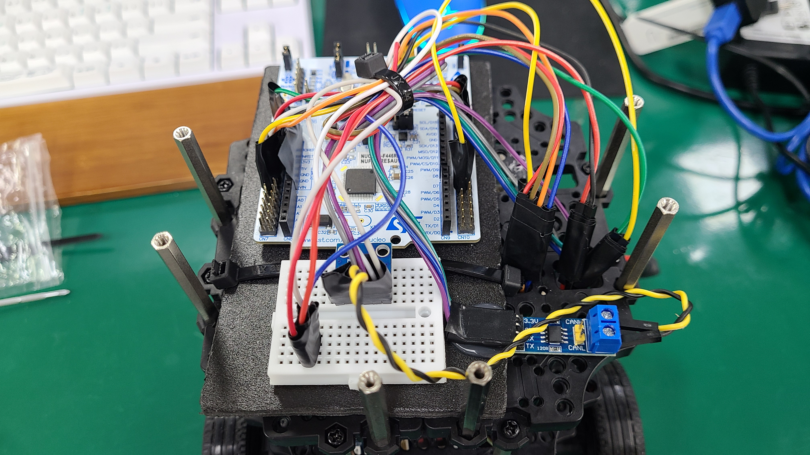
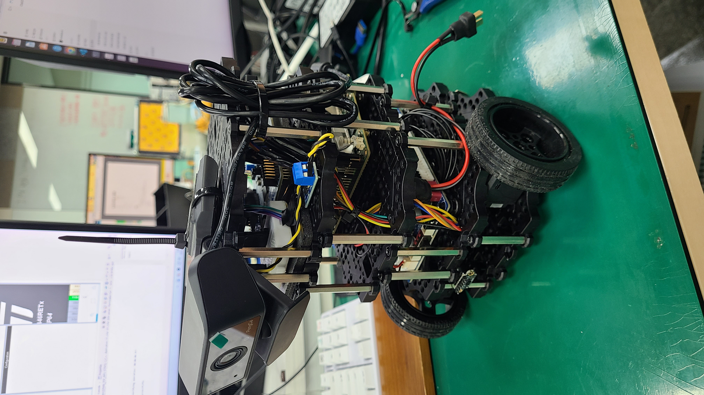
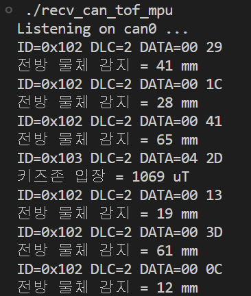
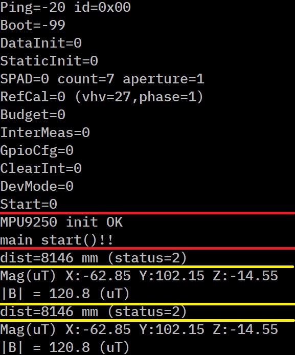

# autonomous-driving-project

### **특정 브랜치 Clone 하기**
```
git clone -b <branch-name> --single-branch <repo-url>

git clone -b Woojin5020 --single-branch https://github.com/whdtjr/autonomous-driving-project.git
```

---

# STM32에 연결된 센서값을 Rockchip으로 CAN 통신으로 보내기 예제

### **실습환경**
- 개발보드1 : Stm32F446RE (Can 컨트롤러 포함 보드)
- 개발보드2 : RockChip 5B (Can 컨트롤러 포함 보드)
- 센서 및 모듈: 
1. [SN65HVD230(캔 트랜시버) - STM32](https://m.vctec.co.kr/product/can-bus-%ED%8A%B8%EB%9E%9C%EC%8B%9C%EB%B2%84-%EB%AA%A8%EB%93%88-sn65hvd230-can-bus-transceiver-breakout-sn65hvd230/10725/)
2. [MPU9250(지자기 센서) - STM32](https://www.devicemart.co.kr/goods/view?no=1342892&srsltid=AfmBOopmpXc45L0LAlqqtuLxXUFJG7LegNpDWJmjNuHnobjGR6D4oxLD)
3. [VL53L0X(거리측정 센서) - STM32](https://www.mechasolution.com/goods/goods_view.php?goodsNo=578840)
4. [SN65HVD230(캔 트랜시버) - RockChip_5B](https://www.devicemart.co.kr/goods/view?no=15007385)

# STM32 - RockChip - Can 통신 하드웨어 구성






## 1. STM32F446 핀 구성

| Pin | 기능|
|-----------|-----------|
| PC13      | Blue_button(캔 통신 테스트 트리거 용도)   |
| PA2       | UART2_TX(printf 디버깅)  |
| PA3       | UART2_RX(printf 디버깅)  |
| PA11      | CAN1_RX(CAN 통신)        |
| PA12      | CAN1_TX(CAN 통신)        |
| PB8       | I2C1_SDA(TOF 센서 사용)  |
| PB9       | I2C1_SCL(TOF 센서 사용)  |
| PC12      | I2C2_SDA(MPU 센서 사용)  |
| PB10      | I2C2_SCL(MPU 센서 사용)  |

## 2. Rock 5B 핀 구성

| Pin | 기능 |
|------------|-----------|
| GPIO4_B3   | 	CAN1_TX_M1(CAN 통신)  |
| GPIO4_B2   | 	CAN1_RX_M1(CAN 통신)  |


# Rock칩 설치 및 환경 설정

### can 통신 추가 하는법
```
# Rockchip 기준 SoC 장치 정보가 담긴 DTB 파일 경로
$ cd /lib/firmware/5.10.0-1012-rockchip/device-tree/rockchip

# Rockchip 기준 특정 주변장치 기능 활성화 시 overlay 디렉터리 내 수정 -> 컴파일 -> extlinux.conf에 추가
$ cd /lib/firmware/5.10.0-1012-rockchip/device-tree/rockchip/overlay


sudo vi /boot/extlinux/extlinux.conf

FDTOVERLAYS /lib/firmware/5.10.0-1012-rockchip/device-tree/rockchip/overlay/rk3588-can1-m1.dtbo


# CAN 장치는 네트워크 인터페이스로 인식됨
rock@rock-desktop:/sys/class/net$ ls
can0  enP4p65s0  lo  wlan0  wlP2p33s0
```

### CAN 통신 코드 실행 방법
```
./RockChip_5B/recv_can_tof_mpu # 실행

```


- 디버깅 사진(RockChip)
---  


- 디버깅 사진(STM32)
--- 

---